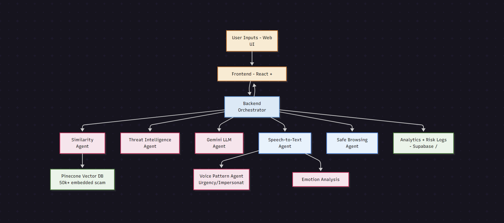
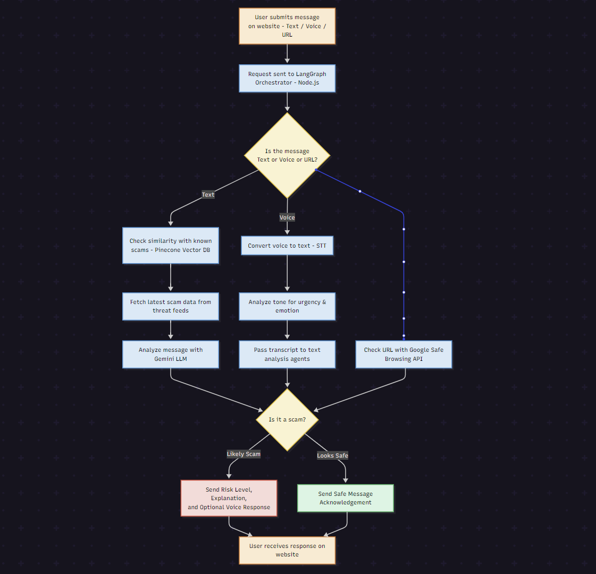

# Multilingual Scam Detection System

An AI-powered, multi-agent system that detects scams shared via website submissions — including text messages, voice notes, and suspicious URLs — across multiple languages and formats.

Built with LangGraph, Node.js, Gemini LLM, Pinecone, and Google Cloud services, the system identifies scams using semantic similarity, emotional tone, real-time threat intelligence, and phishing detection APIs.

---

## 🚀 Features

- ✅ **Smart Scam Detection via Website** — Users can submit suspicious text, voice notes, or URLs directly from a web interface.
- 🧠 **Multi-Agent AI Architecture** — Specialized agents for text similarity, threat intelligence, voice tone/emotion analysis, and phishing detection.
- 🔍 **Text Scam Detection** — Uses a Pinecone vector database with 50,000+ embedded real-world scam examples + Gemini LLM for contextual understanding.
- 🔊 **Voice Scam Analysis** — Transcribes speech using Google STT, analyzes tone and urgency, and evaluates emotional cues before running LLM-based analysis.
- 🌐 **URL Phishing Detection** — Uses Google Safe Browsing API to scan for known malicious links.
- 🗣️ **Multilingual Support** — Supports multiple languages (e.g., English, Hindi, Spanish) in both voice and text.
- ⚡ **Instant Risk Classification** — Outputs a risk level, confidence score, and explanation — optionally converted to voice response using Google TTS.
- 💻 **Modern Frontend** — Built with React and JavaScript, ensuring seamless user experience directly via browser.

---

## 🧩 Architecture Diagrams

### 🔧 Technical System Architecture


### 🔁 User Flow


---

## 🛠️ Tech Stack

- **Frontend:** React, JavaScript
- **Backend:** Node.js, LangGraph
- **LLM Services:** Gemini 1.5 Flash
- **Voice Processing:** Google Cloud Speech-to-Text, Text-to-Speech
- **URL Analysis:** Google Safe Browsing API
- **Semantic Matching:** Pinecone Vector DB
- **Storage/Logs:** Supabase / PostgreSQL

## Project Structure

```
.
├── backend/                 # FastAPI backend
│   ├── app/                # Main application code
│   │   ├── api/           # API endpoints
│   │   ├── core/          # Core functionality
│   │   ├── models/        # Data models
│   │   └── services/      # Business logic
│   ├── tests/             # Backend tests
│   └── requirements.txt    # Python dependencies
├── frontend/               # React frontend
│   ├── src/               # Source code
│   ├── public/            # Static files
│   └── package.json       # Node dependencies
└── .env                   # Environment variables
```

## Setup Instructions

### Environment Variables

Create a `.env` file in the root directory with the following variables:

```
# Google Cloud API Keys
GOOGLE_API_KEY=your_google_api_key_here

# WhatsApp Business API
WHATSAPP_TOKEN=your_whatsapp_business_token_here
WHATSAPP_PHONE_NUMBER_ID=your_whatsapp_phone_number_id_here
WHATSAPP_VERIFY_TOKEN=your_whatsapp_verify_token_here

# Gemini API
GEMINI_API_KEY=your_gemini_api_key_here

# Backend Configuration
BACKEND_HOST=0.0.0.0
BACKEND_PORT=8000

# Frontend Configuration
REACT_APP_API_URL=http://localhost:8000
```

### Backend Setup

1. Create a virtual environment:
```bash
python -m venv venv
source venv/bin/activate  # On Windows: venv\Scripts\activate
```

2. Install dependencies:
```bash
cd backend
pip install -r requirements.txt
```

3. Run the backend server:
```bash
uvicorn app.main:app --reload
```

### Frontend Setup

1. Install dependencies:
```bash
cd frontend
npm install
```

2. Run the development server:
```bash
npm start
```

## API Endpoints

- `POST /api/check-url`: Check URL for phishing/malware
- `POST /api/check-message`: Analyze text message for scams
- `POST /api/check-voice`: Process voice messages
- `POST /api/webhook`: WhatsApp webhook endpoint

## WhatsApp Integration

To set up WhatsApp integration:

1. Create a Meta Developer account and set up a WhatsApp Business API account
2. Configure your webhook URL in the Meta Developer Portal
3. Set up the verification token
4. Update the environment variables with your WhatsApp credentials

## Google Cloud Services Setup

1. Create a Google Cloud project
2. Enable the following APIs:
   - Google Safe Browsing API
   - Cloud Speech-to-Text API
   - Cloud Text-to-Speech API
3. Create API keys and update the environment variables

## Contributing

1. Fork the repository
2. Create your feature branch
3. Commit your changes
4. Push to the branch
5. Create a new Pull Request
